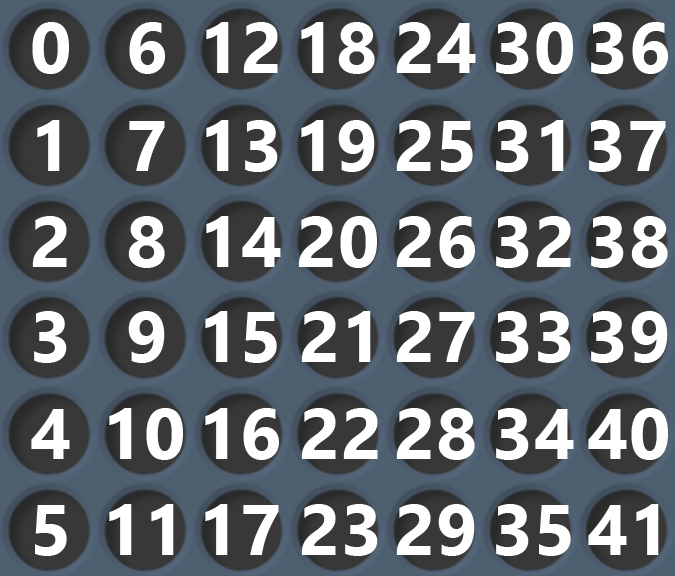
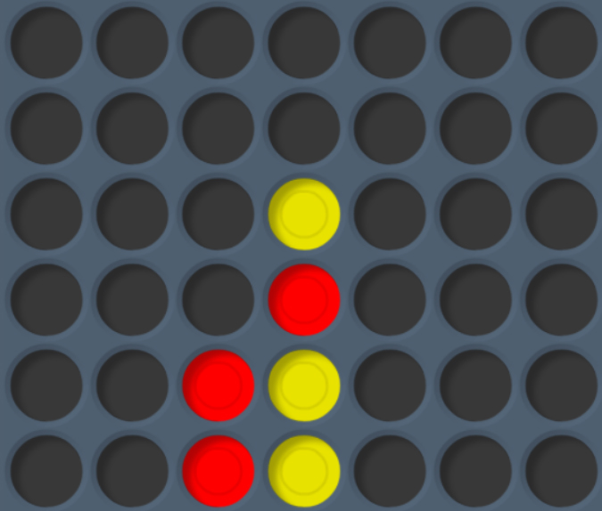
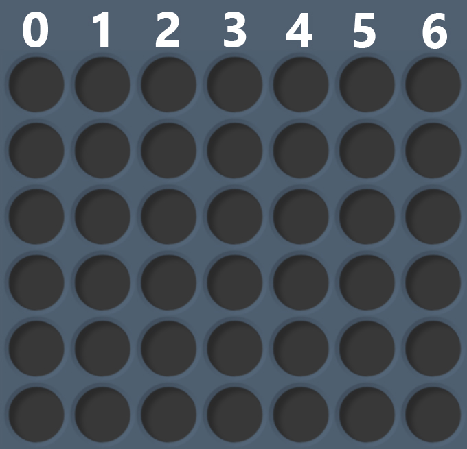

Albot.Online User Guide
=======================
1. [AI Bots](#ai-bots)
2. [Communicate with the server](#communicate-with-the-server)
3. [Client](#client)
4. [Games](#games)
    1. [Connect 4](#connect-4)

# Tutorial
Albot.Online lets you build your own AI bot to play and develop new algorithms. 


Your job is to build your own Local bot, connect it to your Client and then play a game towards the Game server. To get started you will need 3 things:

1. A Client **download link should be here**
2. Your favorite text editor
3. A way to compile/run your code

### Creating your first bot
For this tutorial, we'll play a game of [Connect 4](#connect-4). 


# Games
## Connect 4
Game play can be seen at [Wikipedia](https://en.wikipedia.org/wiki/Connect_Four).
### Messages to receive
These messages must be handled by the Bot:

```
 Name         | Type   | Description 
 -----------------------------------
 Move request | string | 42 integers separated by space ( ) defining the current board position. After “Board position” has been received, the Bot has to send a “Next move” command.
 Game over    | string | "GameOver"
```

#### Message: Move request
This message will be sent to your local Bot containing the current board position. The board position is represented by a 6 by 7 matrix where every cell has one of the following states:
- 1  = Your playing piece
- 0  = Empty square
- -1 = Opponent playing piece
Note: This means that whether you are currently playing as Red or Yellow, your pieces will always be 1 and your opponents -1. 

The board matrix will be sent to you in a plain text message containing 42 numbers all separated by one space. These numbers will be written column by column as you can see below.



As an example, the string `"0 0 0 0 0 0 0 0 0 0 0 0 0 0 0 0 -1 -1 0 0 1 -1 1 1 0 0 0 0 0 0 0 0 0 0 0 0 0 0 0 0 0 0"` yields the following board (assuming you are yellow; for red all `1`s and `-1`s would be interchanged):



#### Message: Game over
Self explanatory. Contains the exact message `“GameOver”`, and indicates that the game is over.

### Messages to send
These messages must be sent by the Bot:

```
 Name        | Type   | Description
 ----------------------------------
 Player move | string | One (1) number between 0-6 indicating the next move. Sent after a Move request message has been received.
```

#### Message: Player move
This is the message that you send containing information about what move you wish to make. You simply send a text message referring to what column you chose to drop your next piece in. The columns are zero indexed, meaning you are expected to send a message from 0-6.



If Albot.Online for whatever reason does not accept your move it will resend the move request until you give a proper response.

## Battleships
Game play can be seen at [Wikipedia](https://en.wikipedia.org/wiki/Battleship\_(game)).

The game consists of two 10x10 boards, yours and your opponents. Both of these will be represented by a string where very square is described by a specific character. The characters will be written in the following order:

```
  0| 1| 2| 3| 4| 5| 6| 7| 8| 9
 10|11|12|13|14|15|16|17|18|19
 20|21|22|23|24|25|26|27|28|29
 30|31|32|33|34|35|36|37|38|39
 40|41|42|43|44|45|46|47|48|49
 50|51|52|53|54|55|56|57|58|59
 60|61|62|63|64|65|66|67|68|69
 70|71|72|73|74|75|76|77|78|79
 80|81|82|83|84|85|86|87|88|89
 90|91|92|93|94|95|96|97|98|99
```

Board messages are sent as a string _with no delimiters_.

### Messages to receive

```
 Name            Type     Description
 ------------------------------------
 Board request | string | "Board request". Answer should be a Message: Initial board.
 Battle board  | string | A board with information whether your missiles have hit the opponent's ships.

```

#### Message: Board request
When the game starts, both players will receive a message requesting their initial ship configuration. When this request is received, a _Message: Initial Board_ needs to be sent.

#### Message: Battle board
When both players have entered their starting position, the players will take turn to fire at each others board. The request sent to the current player will contain his/her "Battle board". The Battle board represents your past actions, and what effect they had on your opponent's board. When this received, a _Message: Battle missile_ should be sent.

The values of the Battle board:

```
 Value | Meaning
 ---------------
     0 | Empty water
     - | Miss
     X | Hit
     S | Sunken ship
```

### Messages to send

```
 Name            Type     Description
 ------------------------------------
 Initial board  | string | The placement of your own ships
 Battle missile | string | The index of what coordinate you want to attack

```

#### Message: Initial board
Send after _Message: Board request_ has been received. The message must be a full board containing five ships, **one of each category**. A ship must be placed horizontally or vertically--it can not be placed diagonally. 

The following are the values for each ship:

```
 Value |   Ship type | Ship size
 -----------------------------
     0 | Empty water | -
     1 | Scoutship   | 2
     2 | Transport   | 3
     3 | Submarine   | 3
     4 | Battleship  | 4
     5 | Carrier     | 5
```

For example, the message

    “0110000000000040000000004555550000400000000040000000000000000000033300002220000000000000000000000000”

yields the following board:
    
```
 0| 1| 1| 0| 0| 0| 0| 0| 0| 0
 0| 0| 0| 0| 4| 0| 0| 0| 0| 0
 0| 0| 0| 0| 4| 5| 5| 5| 5| 5
 0| 0| 0| 0| 4| 0| 0| 0| 0| 0
 0| 0| 0| 0| 4| 0| 0| 0| 0| 0
 0| 0| 0| 0| 0| 0| 0| 0| 0| 0
 0| 0| 0| 0| 0| 3| 3| 3| 0| 0
 0| 0| 2| 2| 2| 0| 0| 0| 0| 0
 0| 0| 0| 0| 0| 0| 0| 0| 0| 0
 0| 0| 0| 0| 0| 0| 0| 0| 0| 0
```

#### Message: Battle missile
When a _Message: Battle board_ is received, a guess for where the ships of the opponent should be placed. Simply send the index (as a string) of what coordinate you want.
