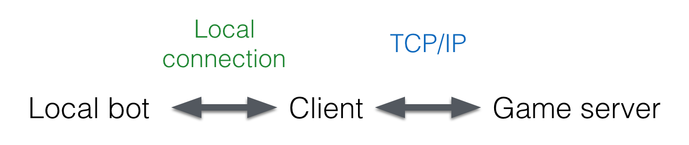

Albot.Online User Guide
=======================
1. [Get started tutorial](#tutorial)
2. Games
    1. [Connect 4](Games/Connect4)
    2. [Battleships](Games/Battleships)

# Tutorial
Albot.Online lets you build your own AI bot to play and develop new algorithms. 

The following picture shows all the different components of Albot.Online.

Your job is to build your own Local bot, connect it to your Client and then play a game towards the Game server. To get started you will need 3 things:

1. A Client **download link should be here**
2. Your favorite text editor
3. A way to compile/run your code

### Creating your first bot
For this tutorial, we'll play a game of [Connect 4](Games/Connect4). The rules are simple, and we only need to do 2 things:

1. Connect to the Client
2. For every turn, choose a column to place the next marker

Let's build our bot in Python for this tutorial to keep everything simple. We will use the `socket` package to help us make the connection to the Client, and we will simply place a marker randomly every turn. 

    import socket
    import random
    
    ## Connect to client
    TCP_IP = '127.0.0.1'                            # localhost
    TCP_PORT = 4000                                 # Choose the same port as the Client -- can be changed
    BUFFER_SIZE = 1024                              # Some arbitrary length >= the max message size
    
    s = socket.socket(socket.AF_INET, 
                      socket.SOCK_STREAM)           # Create socket
    s.connect((TCP_IP, TCP_PORT))                   # Connect
    
    ## Let's play!
    while True:                                     # For every turn
        data = s.recv(BUFFER_SIZE)                      # Read data received from the Client
        board = data.decode("utf-8").split( )           # Parse the message
        print(board)                                  
        action = str(random.randint(0, 6))              # Chose a random column
        print(action)
        s.send(bytes(action, "utf-8"))                  # Send the column
    s.close()                                       # Close the connection

This is of course not perfect: We have no check for when the game ends, nor any security measures for whether we actually connected to the server or not, but it'll do for now. The next step is to play a game!

1. Copy and paste the code from the last section into a file `my_first_bot.py`.
2. Open the Albot.Online Client and log in. 
3. Click _Create game_. Choose _Connect 4_ and _Training_.
4. Press _Open port_ and make sure it says `4000` (or any other port number -- just **make sure it is the same value** as in the code written earlier.
5. Open a terminal and run `python my_first_bot.py`. You should see in the Client GUI that your bot was connected.
6. Press _Play_, and watch as you play your first game!

Congratulations, you just made your first bot :) Now it's time to refine your bot! The message which we discarded before contains information where all markers are placed. See if you can use it to your advantage. 
